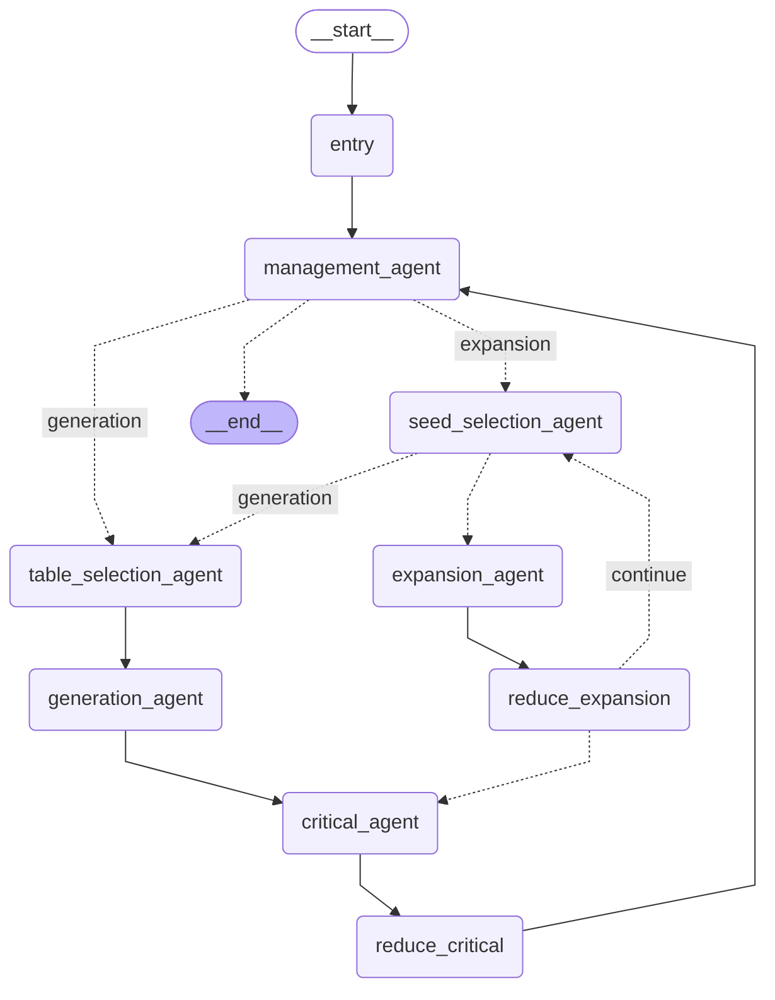

# SQL-Factory
Code for 'SQL-Factory: A Multi-Agent Framework for High-Quality and Large-Scale SQL Generation'

The main code structure is as follows.
``` shell
.
├── agent
│   ├── critical.py
│   ├── expansion.py
│   ├── generation.py
│   ├── management.py
│   ├── seed_selection.py
│   ├── state.py
│   ├── table_selection.py
│   └── tools.py
├── graph.py
├── main.py
└── util
    ├── datapool.py
    └── sql.py

```

`agent` folder mainly includes six agents in the multi-agent architecture, each with its own tool.

`graph.py` defines the complete multi-agent workflow.

`main.py` serves as the entry point for generation, and the usage is as follows:
```shell
python main.py --benchmark <benchmark> --num-sql <sql number>
```


# Implementation of SQL-Factory using LangGraph

